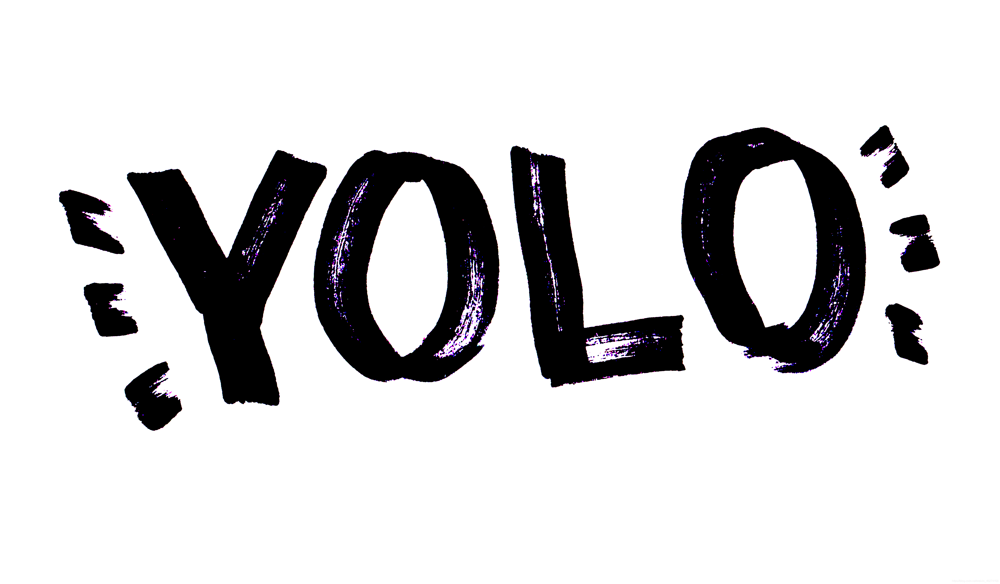
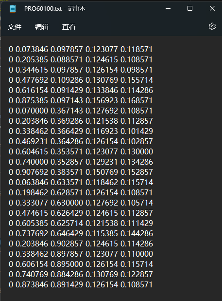
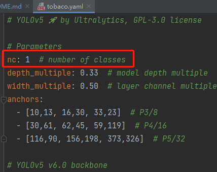
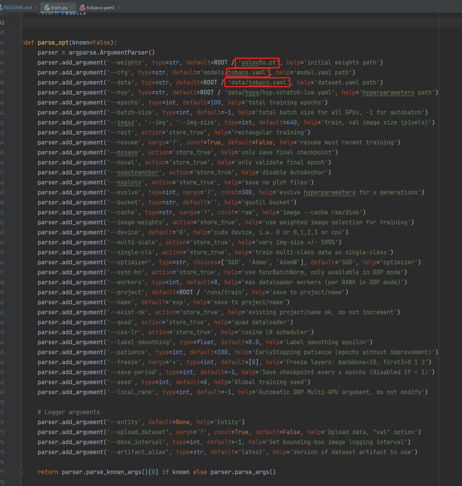
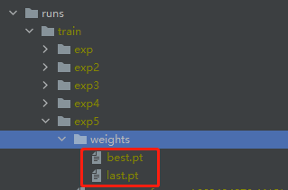
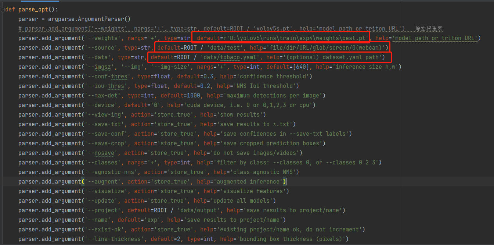

<h1>基于yolov5的烟盒检测</h1>
<h3>前言</h3>
目标检测是计算机视觉领域的一大任务，大致分为一阶段目标检测与两阶段目标检测。其中一阶段目标检测模型以<b>YOLO</b>
系列为代表。最新的YOLOv5在各个数据集上体现出收敛速度快、模型可定制性强的特点。本文主要讲解如何从零训练自己的YOLOv5模型与一些重要参数的含义。
 
<h3>项目目标：</h3>
小A作为一个商铺监管人员，商铺经常从他手中进货。但是有些商户却把自己进的货交给别人来卖，或者没有进货但是拿别的商户的货来卖。我们称这种为套卡户。
这可是违法违规行为。 小A作为监管人员当然不能允许这种事情发生了！为了检测这些商户有没有违规，小A想出了一种办法：是不是可以通过检测货架上的烟的数量，
来发现这些违法违规的商户呢？ 如果这些商户没有进货，但是货柜上的烟却增加了好多，那这些商户可能就是拿了别的商户的烟来卖。如果这些商户进了货，但是货架上的
烟却没有增加，那这些烟是不是就拿去给别人来卖了呢？ 于是聪明的小A又想，每次人工去数货架上的烟，这是多么耗时又耗力的事情啊。所以他想出，是不是可以通过
目前流行的目标检测算法来统计这些数量呢？这样只需要拍一张照片，然后嗖的一下统计结果就出来了。这样就不用一个一个去数了。他从网上一搜，发现yolo算法刚好可以实现
这种目标检测的任务。

<h3>YOLO目标检测算法</h3>
“Yolo (You Only Look Once) 是目标检测 one-state 的一种神经网络。

它的优点是速度快，可以对图像和视频做到实时监测。
具体可以参考github的<a href = "https://github.com/ultralytics/yolov5">Yolov5</a>

<h3>数据准备和检测</h3>
和其他项目一样，在这个项目中，我们同样需要准备数据集进行训练和预测。 我们使用了商店售烟橱窗的照片作为输入数据集，
这些照片来源于商家所提供的现场拍摄照片。其中包含了多种不同品牌的包烟。

由于不同拍摄者和不同设备拍摄出的包烟橱窗照片尺寸大小不一。因此我们首先将数据做了预处理。
将所有图片大小调整为固定尺寸：宽为600px, 高为450px。将图片调整为固定尺寸之后，我们将使用标注工具<a href = "https://github.com/heartexlabs/labelImg">labelimg</a>标注图像。

因为该项目只需要识别包烟，因此只需要对图片中出现的包烟进行标注即可。这里需要注意的是，在labelimg中，需要在左侧将标注类型设置为yolo格式
 这样标好的标签就是.txt格式的了

图片标注好后，将标注文件存储在data/labels文件夹下

可以看到，标签文件里，每一行代表一个包烟目标。后面的数字表示的是每个包烟的坐标

然后我们将原图像存储在data/images文件夹下

这样训练数据就准备完毕啦。我们现在就可以开始更改项目的配置文件

<h3>参数配置修改：</h3>
首先，我们需要修改数据的配置文件: data文件夹下的tobaco.yaml。在这个配置文件中，我们需要设定训练数据集和验证数据集的目录。以及设定需要识别的目标名。
例如，我们的训练路径为：data/images/train， 验证路径为：data/images/val。需要识别的目标名即为我们标注的tobaco。如果有不同的目标需要识别，需要在
下一行添加。（例如 1：car）

 
然后我们将对模型中的参数进行修改。在tobaco.yaml中

需要将nc这个参数设置为对应的类数量。如我们的目标只有一个tobaco，那么将这个设置为1即可

现在我们就可以调整训练脚本中的参数，然后进行训练了
在<i>train.py</i>中

我们需要设定初始化的权重，在这里我们设置为yolov5s.pt
修改模型的配置文件路径：这里我们设置为刚才配置好的<i>models/tobaco.yaml</i>
修改数据的配置文件：<i>models/tobaco.yaml</i>
这样我们就可以开始训练了。

<h3>数据的预测</h3>
当我们训练好后模型后，就可以用训练好的权重进行目标的检测了
训练好的模型权重存放在runs/train下

我们需要修改detect.py文件中的配置

我们需要修改权重的路径，在这里我们设置为训练好的权重：<i>runs\train\exp4\weights\best.pt</i>
测试的数据集路径我们设置为：<i>ROOT / 'data/test'</i> 这样模型将对test文件夹下的图片进行预测
将数据集的配置文件设置为 'data/tobaco.yaml'
这样就可以运行程序对测试图片进行目标检测了。

